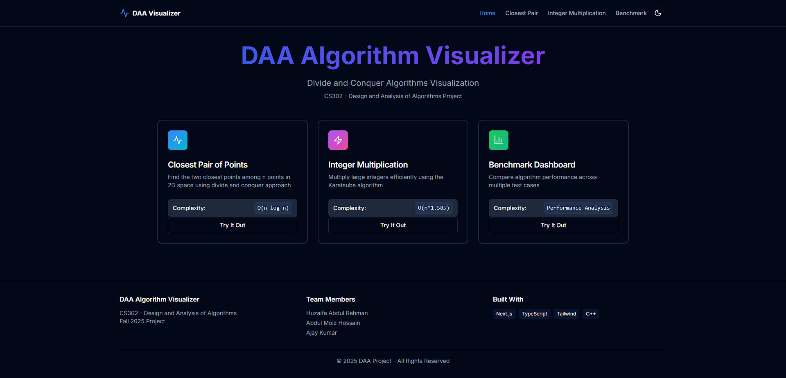
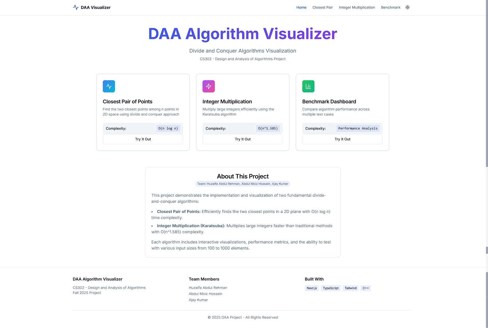
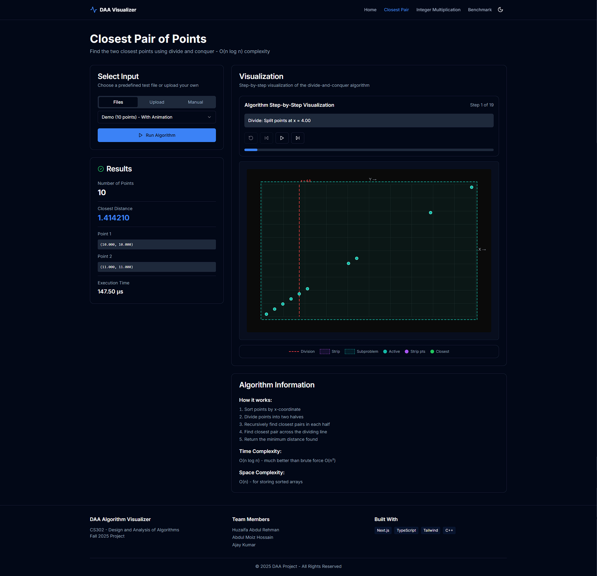
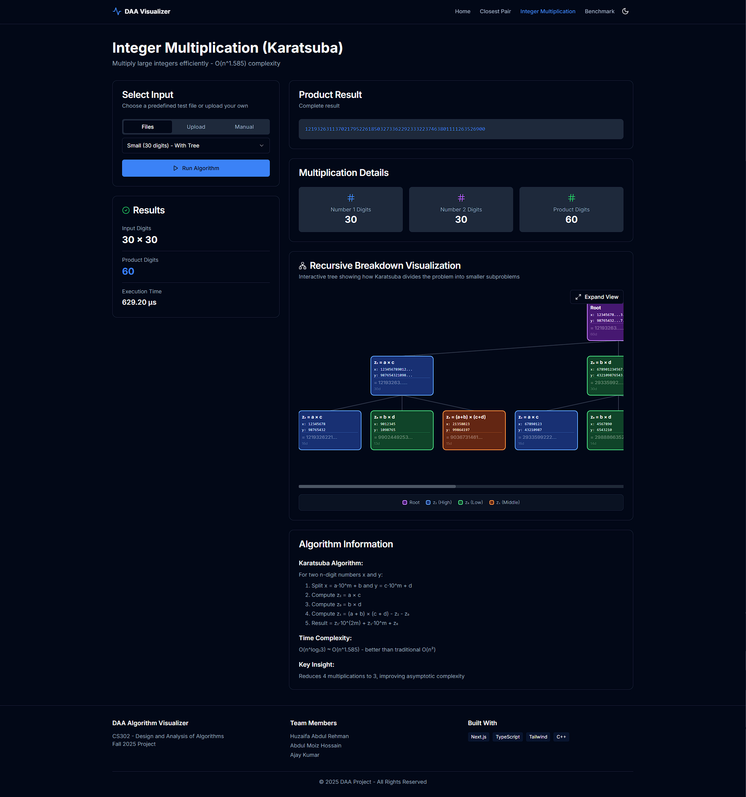
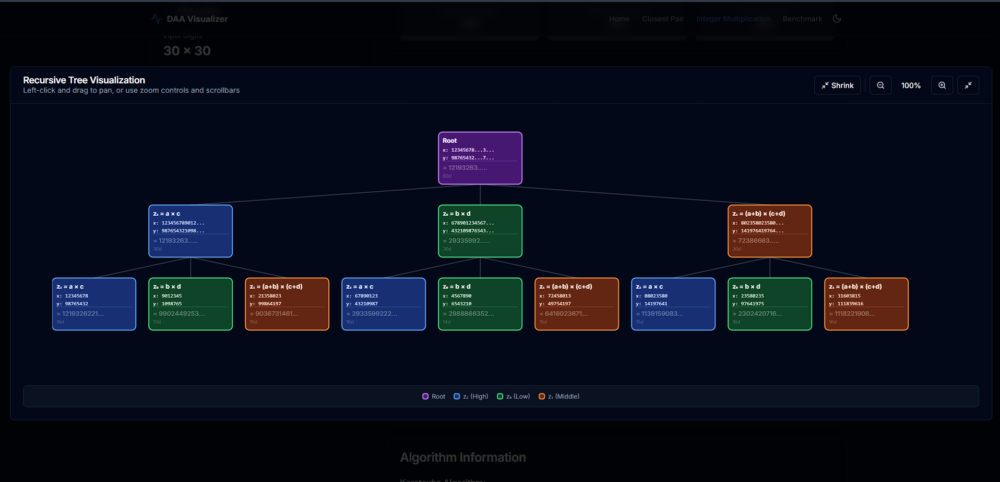
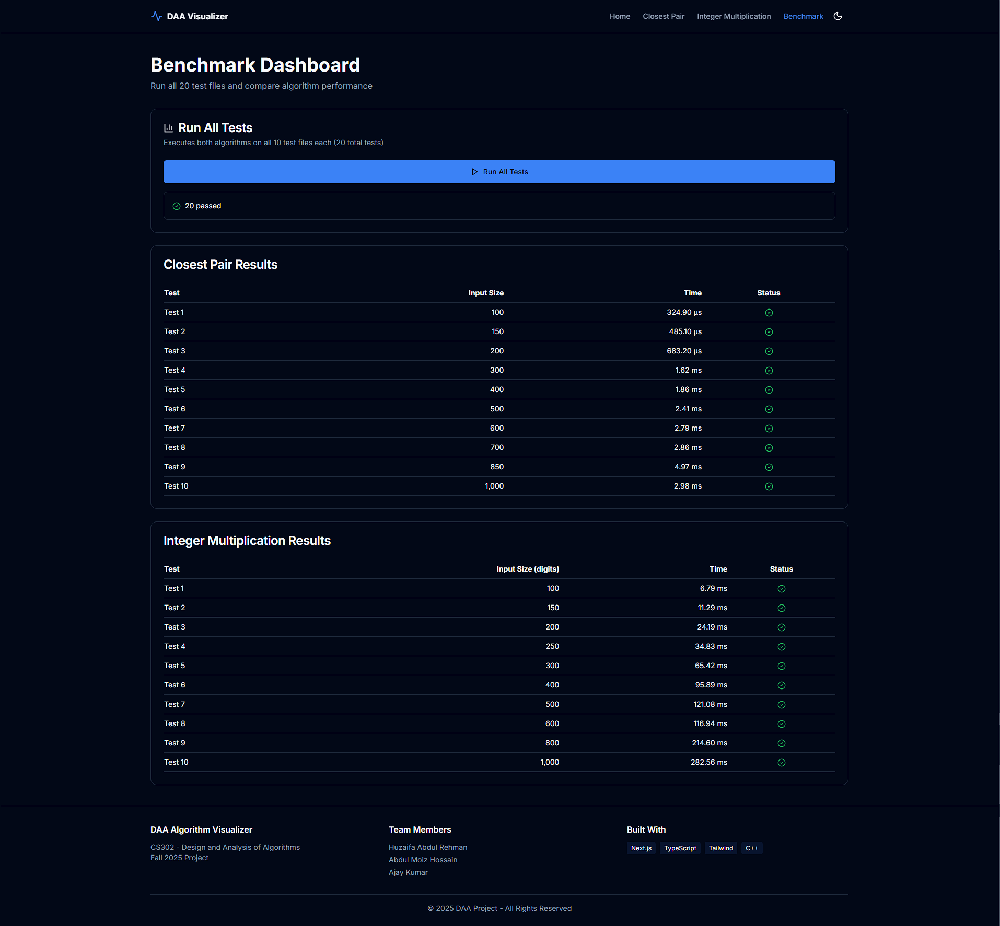

# Design and Analysis of Algorithms - Project 2025

[](https://isocpp.org/)
[](https://nextjs.org/)
[](https://reactjs.org/)
[](https://www.typescriptlang.org/)
[](LICENSE)

A comprehensive collection of divide-and-conquer algorithm implementations with **professional web-based visualizations** for the Design and Analysis of Algorithms course.

## 👥 Team Members

| Name | Roll Number |
|------|-------------|
| **Huzaifa Abdul Rehman** | 23k-0782 |
| **Abdul Moiz Hossain** | 23k-0553 |
| **Ajay Kumar** | 23K-0514 |

---

## 📋 Table of Contents

- [About the Project](#about-the-project)
- [Features](#features)
- [Technologies Used](#technologies-used)
- [Project Structure](#project-structure)
- [Problem Implementations](#problem-implementations)
  - [Question 1: Basic Algorithms](#question-1-basic-algorithms)
  - [Question 2: Advanced Visualization](#question-2-advanced-visualization)
- [How to Run](#how-to-run)
- [Screenshots](#screenshots)
- [Time Complexity Analysis](#time-complexity-analysis)
- [Contributing](#contributing)

---

## 🎯 About the Project

This project showcases **13 algorithmic implementations** focusing on the **Divide and Conquer** paradigm, featuring:

- 📊 **Interactive Web Visualizations** - Step-by-step algorithm execution
- 🎨 **Modern UI/UX** - Dark mode, glassmorphism, smooth animations
- ⚡ **High Performance** - Optimized C++ backend with Next.js frontend
- 📈 **Comprehensive Testing** - 40+ test cases with benchmark dashboard
- 🎓 **Educational Value** - Clear explanations and visual learning

---

## ✨ Features

### 🌐 Web Application (Question 2)
- **Beautiful Landing Page** with animated gradient backgrounds
- **Interactive Visualizations**:
  - Closest Pair: Step-by-step divide-and-conquer animation
  - Integer Multiplication: Recursive tree visualization
- **Dark/Light Mode** with system preference detection
- **Multiple Input Methods**: Predefined files, custom upload, manual entry
- **Real-time Performance Metrics** with benchmark dashboard
- **Responsive Design** - works on all screen sizes
- **Professional UI Components** using shadcn/ui and Radix UI

### 🔢 Algorithm Implementations (Question 1 & 2)
- **13 C++ Implementations** covering classic divide-and-conquer problems
- **Optimized Code** with `-O2` compilation flags
- **Detailed Output** including execution time and complexity analysis
- **Test Data Generation** for comprehensive testing

---

## 🛠️ Technologies Used

### Backend
-  **C++11/14** - Algorithm implementation
- **STL** - Data structures and algorithms
- **Chrono** - High-precision time measurement

### Frontend
-  **Next.js 14.1** - React framework with App Router
-  **React 18.2** - UI library
-  **TypeScript 5.3** - Type safety
-  **Tailwind CSS 3.4** - Utility-first styling
- **Framer Motion** - Smooth animations
- **Recharts** - Performance charts
- **shadcn/ui** - Modern UI components

---

## 📁 Project Structure

```
Daa-Project/
│
├── README.md                    # Main documentation
├── GIT_CHEAT_SHEET.md          # Git collaboration guide
├── INSTRUCTIONS.md              # Quick setup guide
├── .gitignore                  # Git ignore rules
│
├── q1/                         # Question 1: Basic Algorithms
│   ├── a.cpp                   # Algorithm A
│   ├── b.cpp                   # Binary Exponentiation
│   ├── c.cpp                   # Counting Inversions
│   ├── e.cpp                   # Algorithm E
│   ├── f.cpp                   # Peak Element Finder
│   ├── g.cpp                   # Maximum Stock Profit
│   ├── h_1.cpp                 # Median of Two Arrays (Method 1)
│   ├── h_2.cpp                 # Median of Two Arrays (Method 2)
│   └── h_3.cpp                 # Median of Two Arrays (Method 3)
│
└── q2/                         # Question 2: Advanced Visualization
    ├── closest_pair.cpp        # Closest Pair Algorithm (247 lines)
    ├── integer_multiplication.cpp # Karatsuba Multiplication (214 lines)
    │
    ├── test_data/              # Test Files (40+ files)
    │   ├── closest_pair/       # 10 point datasets (100-1000 points)
    │   └── integer_multiplication/ # 10 digit datasets (100-1000 digits)
    │
    └── ui/                     # Next.js Web Application
        ├── app/                # Pages & API Routes
        │   ├── page.tsx        # Landing page
        │   ├── closest-pair/   # Closest pair visualization page
        │   ├── integer-multiplication/ # Karatsuba visualization page
        │   ├── benchmark/      # Performance dashboard
        │   └── api/            # API endpoints (5 routes)
        │
        ├── components/         # React Components (22 components)
        │   ├── closest-pair-step-visualization.tsx
        │   ├── recursive-tree.tsx
        │   ├── static-points-canvas.tsx
        │   ├── navigation.tsx
        │   ├── theme-provider.tsx
        │   └── ui/             # shadcn/ui components
        │
        ├── lib/                # Utilities
        ├── public/             # Static assets
        └── styles/             # Global styles
```

---

## 💡 Problem Implementations

### Question 1: Basic Algorithms

#### 1. Binary Exponentiation (`b.cpp`)
**Problem**: Compute `a^b` efficiently using divide and conquer.
- **Time Complexity**: O(log b)
- **Space Complexity**: O(log b) - recursion stack
- **Approach**: Exponentiation by squaring
```cpp
// If b is even: a^b = (a^(b/2))^2
// If b is odd:  a^b = (a^(b/2))^2 × a
```

#### 2. Counting Inversions (`c.cpp`)
**Problem**: Count pairs (i, j) where i < j but arr[i] > arr[j].
- **Time Complexity**: O(n log n)
- **Space Complexity**: O(n)
- **Approach**: Modified merge sort

#### 3. Peak Element Finder (`f.cpp`)
**Problem**: Find an element greater than or equal to its neighbors.
- **Time Complexity**: O(log n)
- **Space Complexity**: O(log n) - recursion stack
- **Approach**: Binary search on array

#### 4. Maximum Stock Profit (`g.cpp`)
**Problem**: Find maximum profit from buying and selling stocks.
- **Time Complexity**: O(n log n)
- **Space Complexity**: O(n)
- **Approach**: Divide and conquer on difference array

#### 5. Median of Two Sorted Arrays (`h_1.cpp`, `h_2.cpp`, `h_3.cpp`)
**Problem**: Find n-th smallest element from two sorted arrays.
- **Time Complexity**: O(log n)
- **Space Complexity**: O(1)
- **Approach**: Binary search on partitions

---

### Question 2: Advanced Visualization

#### 🎯 Algorithm 1: Closest Pair of Points

**File**: `q2/closest_pair.cpp` (247 lines)

**Problem**: Find the two closest points among n points in 2D space.

**Algorithm**: Divide and Conquer
- **Time Complexity**: O(n log n)
- **Space Complexity**: O(n)

**Implementation Features**:
- ✅ Sorts points by x and y coordinates
- ✅ Recursively divides plane into halves
- ✅ Checks strip area for cross-boundary pairs
- ✅ Generates JSON trace for visualization (n ≤ 50)
- ✅ Handles 100-1000 point datasets

**Visualization Features**:
- 🎨 Step-by-step animation with playback controls
- 📍 Divide line visualization (red dashed)
- 🎯 Active region highlighting (teal)
- 🟣 Strip area visualization (purple)
- ✅ Closest pair highlighting (green)
- ⏯️ Play, pause, step forward/backward controls
- 📊 Progress tracking with step descriptions

---

#### 🔢 Algorithm 2: Karatsuba Integer Multiplication

**File**: `q2/integer_multiplication.cpp` (214 lines)

**Problem**: Multiply arbitrarily large integers efficiently.

**Algorithm**: Karatsuba's Fast Multiplication
- **Time Complexity**: O(n^1.585) where n = number of digits
- **Space Complexity**: O(n)

**Implementation Features**:
- ✅ String-based arithmetic for large numbers
- ✅ Recursive three-way split (z2, z0, z1)
- ✅ Generates tree visualization (≤50 digits)
- ✅ Handles 100-1000+ digit multiplication
- ✅ Falls back to naive method for small numbers

**Visualization Features**:
- 🌳 Interactive recursive tree display
- 🎨 Color-coded node types:
  - 🟣 Purple - Root (original multiplication)
  - 🔵 Blue - z₂ (high digits: a × c)
  - 🟢 Green - z₀ (low digits: b × d)
  - 🟠 Orange - z₁ (middle term)
- 🔍 Zoom controls (30%-150%)
- 🖱️ Pan with left-click drag
- 📏 Smart number truncation for readability
- 📊 Depth and digit count tracking

---

## 🚀 How to Run

### Prerequisites
- **Node.js** v18 or higher
- **npm** or **yarn** package manager
- **C++ Compiler** (g++/MinGW/MSVC)
- **Git** (optional)

### Quick Start (Question 2 - Web Application)

#### Step 1: Clone Repository
```bash
git clone https://github.com/amh1k/Daa-Project.git
cd Daa-Project
```

#### Step 2: Compile C++ Programs
```bash
cd q2
g++ -O2 closest_pair.cpp -o closest_pair.exe
g++ -O2 integer_multiplication.cpp -o integer_multiplication.exe
```

#### Step 3: Install Dependencies
```bash
cd ui
npm install
```

#### Step 4: Run Development Server
```bash
npm run dev
```

#### Step 5: Open Browser
Navigate to: **http://localhost:3000**

---

### Running Question 1 Algorithms

```bash
# Navigate to q1 directory
cd q1

# Compile and run any algorithm
g++ b.cpp -o b.exe
./b.exe

# Example: Binary Exponentiation
echo "2 10" | ./b.exe
# Output: 1024

# Example: Counting Inversions
./c.exe
# Output: The number of inversions are: 22
```

---

## 📸 Screenshots

### 🏠 Landing Page (Dark Mode)

*Beautiful gradient animations with glassmorphism effects, featuring three main algorithm sections*

### 🌞 Light Mode Support

*Professional light theme with optimal contrast and accessibility*

### 📍 Closest Pair Visualization

*Step-by-step divide-and-conquer animation with playback controls, divide line visualization, and active region highlighting*

**Features:**
- Interactive canvas visualization
- Play, pause, step forward/backward controls
- Real-time algorithm step descriptions
- Multiple input methods (predefined, custom, manual)
- Compact footer legend with color coding

### 🔢 Integer Multiplication - Karatsuba Algorithm

*Large number multiplication with result display and performance metrics*

**Features:**
- Support for 100-1000+ digit numbers
- Instant calculation results
- Execution time tracking
- Clean result presentation

### 🌳 Recursive Tree Visualization

*Interactive tree showing Karatsuba's recursive breakdown with color-coded node types (z₀, z₁, z₂)*

**Features:**
- Expand view with zoom controls (30%-150%)
- Pan with left-click drag
- Shrink button for compact view
- Color-coded nodes: Purple (Root), Blue (z₂), Green (z₀), Orange (z₁)
- Horizontal scrollbar for wide trees
- Smart number truncation for readability

### 📊 Benchmark Dashboard

*Comprehensive performance testing with real-time progress tracking for all 20 test cases*

**Features:**
- Batch execution of all test files
- Real-time progress indicators
- Side-by-side performance comparison
- Success/failure status for each test
- Execution time metrics
- Dataset size information

---

## ⏱️ Time Complexity Analysis

| Algorithm | Problem | Time Complexity | Space Complexity | Lines of Code |
|-----------|---------|-----------------|------------------|---------------|
| **Binary Exponentiation** | Compute a^b | O(log b) | O(log b) | ~30 |
| **Counting Inversions** | Count inversions | O(n log n) | O(n) | ~50 |
| **Peak Element** | Find peak | O(log n) | O(log n) | ~40 |
| **Max Stock Profit** | Maximum profit | O(n log n) | O(n) | ~60 |
| **Median of Arrays** | Find median | O(log n) | O(1) | ~70 |
| **Closest Pair** | 2D point distance | O(n log n) | O(n) | 247 |
| **Karatsuba Multiply** | Large integer multiplication | O(n^1.585) | O(n) | 214 |

---

## 🎓 Key Concepts Demonstrated

### Algorithmic Techniques
- ✅ **Divide and Conquer** - Breaking problems into smaller subproblems
- ✅ **Binary Search** - Efficient searching in sorted/partially sorted data
- ✅ **Merge Sort** - Efficient sorting with additional applications
- ✅ **Dynamic Problem Solving** - Converting problems to known formats
- ✅ **Optimization** - Achieving logarithmic and linearithmic complexities

### Software Engineering
- ✅ **Full-Stack Development** - C++ backend + React frontend
- ✅ **API Design** - RESTful endpoints with error handling
- ✅ **Component Architecture** - Reusable React components
- ✅ **Type Safety** - TypeScript for robust code
- ✅ **Performance Optimization** - Lazy loading, caching, GPU acceleration
- ✅ **Responsive Design** - Mobile-first approach
- ✅ **Accessibility** - WCAG-compliant UI

### UI/UX Design
- ✅ **Modern Design Patterns** - Glassmorphism, gradients
- ✅ **Smooth Animations** - Framer Motion for professional feel
- ✅ **Dark Mode** - System preference detection
- ✅ **Interactive Visualizations** - Canvas & SVG rendering
- ✅ **User Feedback** - Loading states, progress bars, error messages

---

## 📚 Educational Value

### For Students
- 📖 **Step-by-step algorithm execution** - Visual learning
- 💡 **Clear complexity explanations** - Understand time/space trade-offs
- 🧪 **Multiple test cases** - Edge case handling
- 📊 **Performance comparison** - Benchmark different inputs

### For Instructors
- ✅ **Production-ready code** - Demonstrates best practices
- ✅ **Comprehensive documentation** - Easy to understand and grade
- ✅ **Interactive demos** - Use in lectures
- ✅ **Extensible architecture** - Students can add more algorithms

---

## 🔧 Advanced Features

### Performance Optimization
- **C++ Backend**: `-O2` optimization flags
- **React Frontend**: Code splitting, lazy loading
- **Canvas Rendering**: GPU-accelerated drawing
- **Smart Caching**: Webpack build optimization

### Error Handling
- ✅ Executable validation
- ✅ Input file validation
- ✅ Parse error detection
- ✅ Timeout handling (30s limit)
- ✅ User-friendly error messages

### Testing
- 40+ predefined test files
- Custom file upload support
- Manual input validation
- Edge case coverage
- Performance benchmarking

---

## 🤝 Contributing

This is an academic project. For improvements:

1. Fork the repository
2. Create feature branch: `git checkout -b feature/improvement`
3. Commit changes: `git commit -m 'Add improvement'`
4. Push to branch: `git push origin feature/improvement`
5. Open Pull Request

---

## 📧 Contact

For questions or discussions:

- **Huzaifa Abdul Rehman** - 23k-0782
- **Abdul Moiz Hossain** - 23k-0553
- **Ajay Kumar** - 23K-0514

---

## 📄 License

This project is created for educational purposes as part of the Design and Analysis of Algorithms course (CS302 - 5th Semester).

---

## 🙏 Acknowledgments

### References
- **Introduction to Algorithms (CLRS)** - Algorithm theory
- **GeeksforGeeks & LeetCode** - Problem-solving inspiration
- **Next.js Documentation** - Web framework guidance
- **shadcn/ui** - Component library
- **Framer Motion** - Animation library

### Inspiration
- Algorithm visualization tools (VisuAlgo, Algorithm Visualizer)
- Professional web applications (Figma, VS Code)
- Academic research papers on divide-and-conquer

---

## 📊 Project Statistics

- **Total Files**: 2,800+ (including dependencies)
- **Custom Code**:
  - 13 C++ algorithm implementations
  - 22 React components
  - 5 API routes
  - 40+ test data files
- **Lines of Code**:
  - C++: 600+ lines
  - TypeScript/TSX: 3,000+ lines
- **Test Coverage**: 20 comprehensive test cases
- **Supported Input Sizes**:
  - Closest Pair: 10-1000 points
  - Integer Multiplication: 12-1000+ digits

---

## 🎯 Project Achievements

✅ Complete implementation of 13 divide-and-conquer algorithms
✅ Professional web application with modern tech stack
✅ Interactive visualizations demonstrating algorithm internals
✅ Comprehensive test suite with 40+ test cases
✅ Beautiful UI design with dark mode support
✅ Performance benchmarking capabilities
✅ Educational documentation for learning
✅ Multiple input methods for flexibility
✅ Robust error handling and validation
✅ Production-ready deployment capability

---

## 🚀 Future Enhancements

- [ ] Add more algorithms (Quick Sort, Heap Sort, etc.)
- [ ] Export visualization as GIF/Video
- [ ] Mobile app version
- [ ] Algorithm complexity calculator
- [ ] User accounts and saved visualizations
- [ ] Collaborative features
- [ ] Multi-language support

---

**⭐ If you find this repository helpful, please consider giving it a star!**

---

**Repository**: https://github.com/amh1k/Daa-Project
